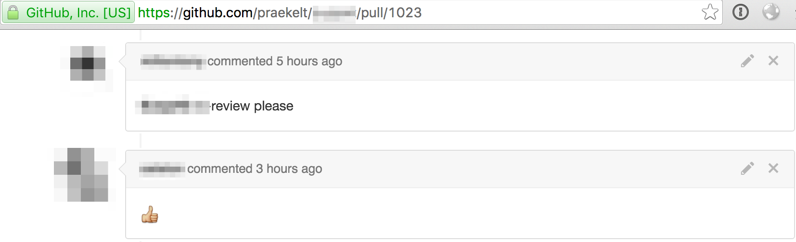

**********
Cheatsheet
**********

If you want to get started as quickly as possible, here is a cheatsheet with
working examples of what's required.

This will help you get up to speed with the way we do things fast.

The perfect dev setup
#####################

Our tools and software are centered very much around Open Source and Linux.

A lot of what we do happens on the command line.

In order to help you get started, we have provided setups for Ubuntu and Mac
OSX.

If you are running Windows, we strongly recommend running an Ubuntu Linux
virtual machine.

Ubuntu
******

1. Setup git::

    aptitude install git

2. Get hubflow::

    git clone https://github.com/datasift/gitflow
    cd gitflow
    sudo ./install.sh

3. Symlink git to hub::

    sudo ln -s /usr/bin/git /usr/local/bin/hub

4. Test::

    hub hf version

If you see this, or something similar, you are good to go::

    1.5.2 - latest version

macOS
*************

1. Setup XCode Developer tools:

Download from the App store here: https://itunes.apple.com/us/app/xcode/id497799835?ls=1&mt=12

2. Install homebrew:

From terminal::

    ruby -e "$(curl -fsSL https://raw.githubusercontent.com/Homebrew/install/master/install)"

3. Get hubflow::

    brew install hubflow

4. Test::

    hub version

If you see this, or something similar, you are good to go::

    git version 2.4.9 (Apple Git-60)
    hub version 2.2.2

Working with Github
###################

Cloning a repository
********************

When working with our repostories, we would have created the repository for you.

Your next steps are to get it onto your local machine and initialize it for use with hubflow.
::

    git clone <Repo URL>
    hub hf init

Example with that::

    $ hub clone praekelt/ways-of-working
    Cloning into 'ways-of-working'...
    remote: Counting objects: 290, done.
    remote: Total 290 (delta 0), reused 0 (delta 0), pack-reused 290
    Receiving objects: 100% (290/290), 48.84 KiB | 71.00 KiB/s, done.
    Resolving deltas: 100% (184/184), done.
    Checking connectivity... done.
    $ cd ways-of-working/
    ways-of-working $ hub hf init
    Using default branch names.

    Which branch should be used for tracking production releases?
       - develop
    Branch name for production releases: [master]

    Which branch should be used for integration of the "next release"?
       - develop
    Branch name for "next release" development: [develop]

    How to name your supporting branch prefixes?
    Feature branches? [feature/]
    Release branches? [release/]
    Hotfix branches? [hotfix/]
    Support branches? [support/]
    Version tag prefix? []
    $

This project is now ready for use with Praekelt's ways of working.

Writing code
************

Now that the repository is ready, you can now start adding code to it.

The steps are as follows:

1. Create an issue on github.
::

    hub issue create
    <enter text>

2. Start a new feature with hubflow named :code:`issue-<issue # you created in step 1>-<description of work>`
::

    hub hf feature start issue-1-going-to-write-some-code

3. Write code

This is where the actual magic happens.

4. Add it

-   add a single file
::
    git add <FILENAME>

-   add all changed files
::
    git add  .

5. Commit it
::

    git commit -m "hey look, real work!"

6. Push it back up to github
::

    hub push

7. Open a pull request (PR)
::

    hub pull-request -b develop

You can reference the issue by saying "Fixes #<issue number>" in the body
of the PR. This will automatically close the issue when the PR is merged.

8. Get it tested (automatically #thanks-travis-ci), reviewed and +1'ed

.. image:: images/testing_pull_request.png
  :align: center

9. Merge it into develop

10. Finish the feature
::

    hub hf feature finish

11. Rinse and repeat

Merging develop back into your branch
*************************************

Often your feature has "fallen behind" develop.

Before you can merge your code in you will have to merge develop into your branch.

Do this::

    hub merge develop
    hub merge push

This then merges develop into your feature branch and pushes it back to github.

Our coding best practices
#########################

We do this all the time, so here are a couple of 'quiet rules' we stick to:

* Write tests early on in the development process
* One change per feature (where possible)
* Always convert issues to pull requests (it just makes issue clean up easier)
* Commit often (smaller commits help in showing you what went wrong)
* When in need of help, generate a PR and ask for assistance
* Set yourself a deadline, if you haven't cracked the problem by your deadline, start talking to people
