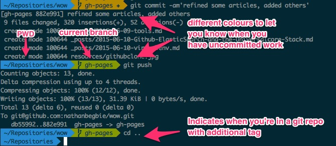

# Tools that we use

This article is going to briefly cover some of the tools you'll need to work here and then go into some of the specific tools that we use and that you need to install. If you run into any trouble installing any of the necessary tools, ask us for help :)

## Get familiar with a text editor

There's a ton of debate about what's better for a development environment in terms of text editors and IDEs. At Praekelt, almost everyone uses a text editor. Popular ones include [VSCode](https://code.visualstudio.com/), [Sublime Text](http://www.sublimetext.com/), [Emacs](http://www.gnu.org/software/emacs/), [Vim](http://www.vim.org/) and [Atom](https://atom.io/). Sublime Text will give you an unlimited free trial if you're happy clicking 'ignore' on sporadic pop ups asking you for cash. The others are free. A text editor is preferred because it gives you more flexibility with regards to editing various types of files and they all have some great add-ons (packages) that provide you with added functionality. Having said that, if you have an IDE that works for you, great :) As long as you're using a tool that you're comfortable with and enables you to get the job done, we don't mind. If you're at a complete loss as to what to get, I'd suggest VSCode.

## pep8 Linter

There are a bunch of options out there, but make sure you get some kind of add on to check that your code adheres to [pep8](https://www.python.org/dev/peps/pep-0008/).

## Homebrew

For those of you with macs, install [Homebrew](http://brew.sh/). Those of you with Ubuntu will already have this functionality with the `apt-get` command. This will make it much easier and faster for you to install software. Instead of downloading a file, unzipping it and manually running an install, this can all be taken care of from the command line. e.g:

```
brew install node
```

or for the Ubuntu crowd:

```
apt-get install node
```

## Gitflow and hub

It will make your life much easier if you install gitflow and hub, in order to adhere to our ways of working process.

For Mac:
```
$ brew install git-flow
$ brew install hub
```

For Ubuntu:
```
$ apt-get install git-flow
$ apt-get install hub
```

## Virtualenv and Pip

You must install virtualenv. Basically, virtualenv allows you to have different versions of software and packages on your machine at the same time. See the virtualenv article <!-- link needed --> on what it does and how to use it. You should have python installed on your machine, which has pip bundled with it in in later versions. Pip is a package management system used to install and manage software packages written in Python. Just to make sure, do the following:

```
$ apt install python-pip
```

Then use Pip to install virtualenv

```
$ pip install virtualenv
```

## Tools that some of the team recommends
I took a brief poll of some of the devs for tools that they use and find useful. Here are a couple that you may want to look into.

* for code editors
  * `emmet`
  * `gitgutter`
  * `jshint`
  * various syntax highlighters
* for node
  * `nvm` for running different node versions
  * `npm` for package management
  * `grunt`, specifically `grunt watch` tasks for auto running tests
* `jq`, `sed`, and all the other command line things, (`sort`, `uniq`, `cat`, `comm`, etc)

## Tools that I use
Here are some of the tools that I've found helpful. You're under no obligation to use them and they're mostly mac specific.

### iTerm

[iTerm](https://www.iterm2.com/) is a better looking version of Apple's Terminal and has added functionality. It also works well with oh-my-zsh. (Mac only)

### Oh-my-zsh

[Oh-my-zsh](http://ohmyz.sh/) is basically an add-on to terminal. It looks pretty, but can also give you helpful information while you work, such as your present working directory, what branch of a repo you're in and whether your git repo is up to date. One of its coolest features though is tab completion, which is helpful when working with gitflow.



### Skitch

[Skitch](https://evernote.com/skitch/) is just a helpful image tool, especially for front-end work, for capturing screenshots, adding annotations and sharing with Slack. (Mac Only)

## In Summary

We don't expect you to have this all done when you arrive here. It's likely that you'll run into problems here and there or need help or are unsure about something. That's ok, we'll be there to help you out. This is just a checklist that you should check before starting actual coding work.

Make sure that you install/have the following

- A text editor/IDE with a pep8 linter installed
- Homebrew (if you're on a mac)
- git-flow and hub
- Python
- Elasticsearch
- Pip and Virtualenv
