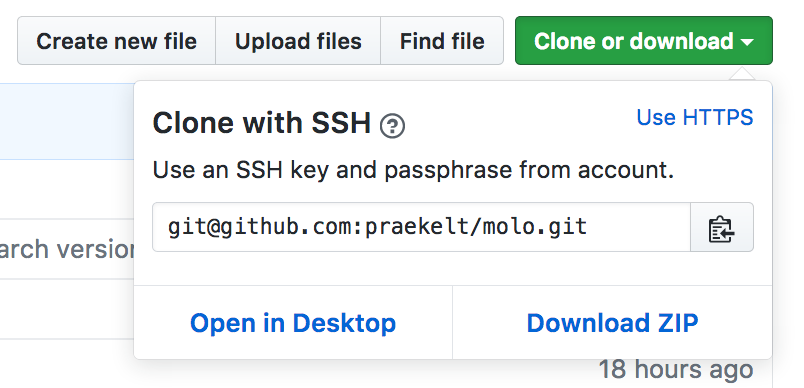

# Git and the basics

Git is going to be a huge part of how you use and write software here. Lots of articles have already been written about git so we're not going to repeat what's already been said:

If you're unsure about git, or need a refresher, check out [this article](http://alistapart.com/article/get-started-with-git) to get the basics right.

Familiarize yourself with the syntax of git, because we will expect you to be able to do this in the terminal, even if you prefer a GUI. However, there are some helpful tools that make working with git easier. I use [GitX Kraken](https://www.gitkraken.com/), a multi-platform git GUI, to see the changes that I have made before committing. There are also tools for the terminal like [oh-my-zsh](http://ohmyz.sh/) which provide helpful information about git repositories within the command line (for Linux and OSX).

I speak from experience when I say that git is not always the easiest thing to get right and I've managed to bugger things up a fair amount. If in doubt, ask someone!

## Github
You should have a Github account, if not, [please get one](https://github.com/join). You need to send your Github account details to one of the admins at Praekelt, who will add you to our organizations; [Praekelt Foundation](https://github.com/praekeltfoundation/) and/or [Praekelt](https://github.com/praekelt/) (this may vary depending on what you're working on). Almost all of our work is open source, so anyone can view and clone our repos. However you will need to get push permissions for each repo that you work on. Contact the appropriate admin. Familiarize yourself with pushing and pulling with Github. When you use `git clone` with GitHub, use the SSH version of the repo URL, not the HTTPS URL.

Helpful tip! Every time you push to Github, it asks you for your username and password which can get pretty annoying. There's a secure way to skip this step, using SSH. Use [this article](https://help.github.com/articles/connecting-to-github-with-ssh/) to get it set up. Note that this links the machine that you do this on, to your Github account, so only do this on your machine.

## In summary

- get to know the basic git commands
- make sure you have a Github account
- ensure that you get added to the Praekelt organizations on Github when you get here
- use SSH to speed up the git process on your machine.
