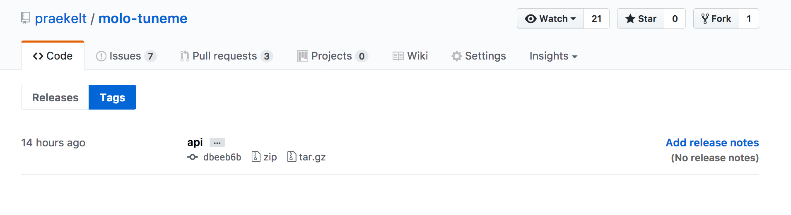
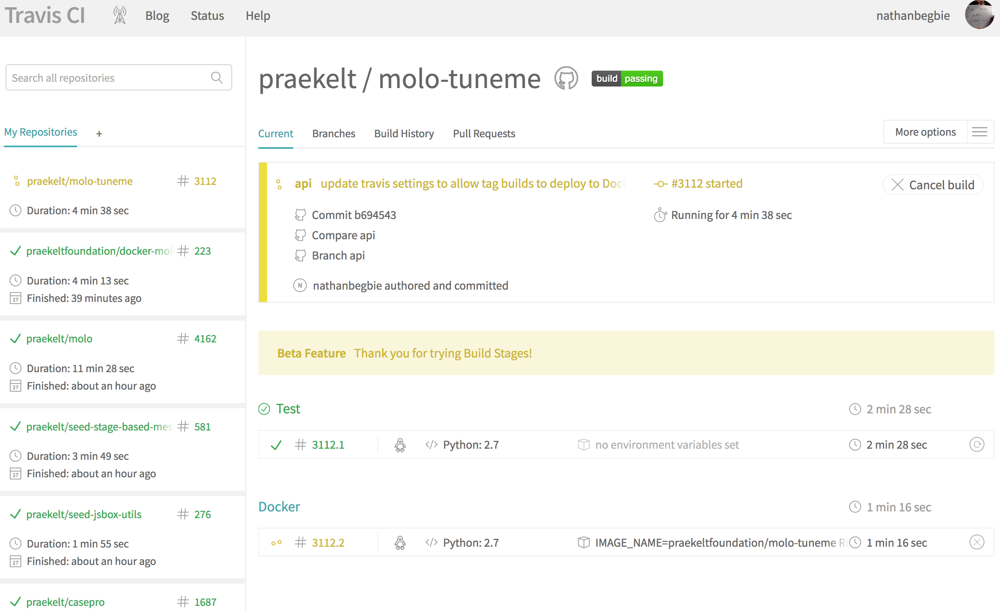
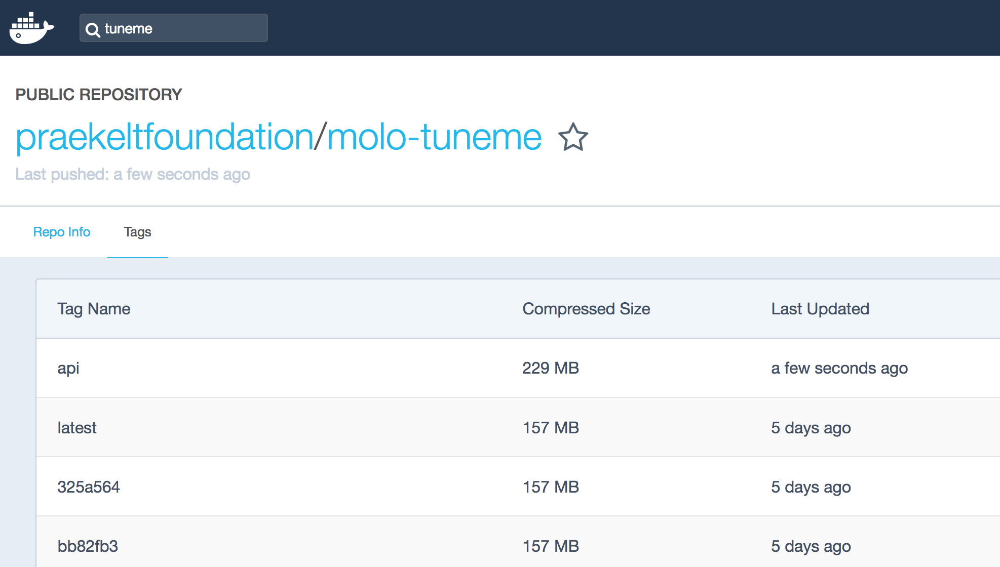
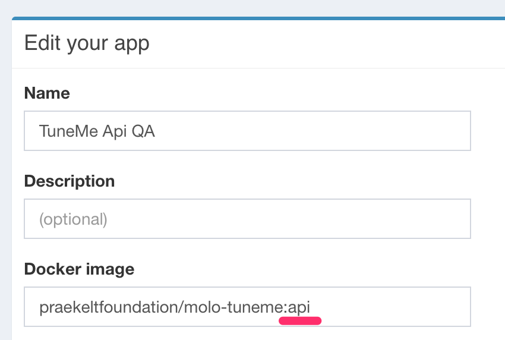
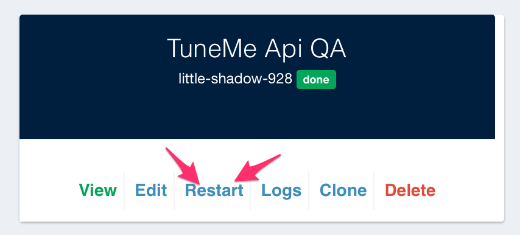

# Creating Tagged Releases

This tutorial covers creating Tagged Releases with Github, Travis and Mission Control.

The ability to create tagged releases in our molo sites, allows us to test a QA version of our code, without merging our changes into the develop branch.
Note that this currently only works for sites like TuneMe and Springster, not molo.core or a particular package.

This tutorial will explain how to create a tagged release for a branch on TuneMe, as an example.

## Creating your first tagged release

### Ensure everything is configured

Make sure that Travis is set up for to create tagged releases.
See [this commit](https://github.com/praekelt/molo-tuneme/pull/489/commits/5eb3488433b0c8daba2fd37f6f9a883c2f446d31) as an example of how to do this.
Check that the account is set up to handle tagged releases on Docker Hub.
At the time of writing this, both Springster and TuneMe are set up to handle tagged releases.

### Create the tag

Create the tag locally, on the branch that you want to test in a QA environment.
The tag name should be something short and descriptive.
For example `api`.

```
git tag <tag name>
```

Tell github about the tag by pushing your tag

```
git push origin <tag name>
```

You can check that that tag has been created by going to the `/releases` section on Github.
e.g. `https://github.com/praekelt/molo-tuneme/releases` or more specifically for the tags, `https://github.com/praekelt/molo-tuneme/tags`.



### Check on the Docker Image creation process

If you check Travis, it should automatically start a new build, named after your tagged release.



Once all of the tests have passed on Travis, it will bundle everything up and create a Docker Image, containing everything needed to run an instance of your code in QA.
That image will be tagged with the same tag you used earlier.
If everything passes, the Image will then be pushed to the associated account on Docker Hub.
In this example, it will be `https://hub.docker.com/r/praekeltfoundation/molo-tuneme/tags/`.
You should see the tag you created, listed at the top.



### Update QA Mission Control

Once you see the tag, Go to QA Mission Control, find the QA instance that you want to test with.
Click on the 'edit' link.
Check the field called `Docker Image`


Change the listed docker image being used to your tag. In this case it will be `api`.



Finally, hit 'Submit' at the bottom of the page to ensure the changes are made. The site will restart and you should see your changes when it gets back up and running.

## Warnings
One of the possible gotchas with QA instances is the possiblility of corrupting the DB with migrations.
Speak to someone if you're not sure what affects your changes could have.

## Recreating a tagged release

Okay, so you've made some changes and you want to see those new changes in QA.

### Delete the tags

In order to create the new tagged release, you need to delete the tag where it is being used.
To do this, first delete the tag on Gihub.

You can do this via the command line using:

```
git push --delete origin <tag name>
```

Then delete the tag locally, using the following:

```
git tag --delete <tag name>
```

### Follow the same process as above
You then need to recreate the tags, push them to Github, wait for tests to pass and Docker Hub to update.
You don't need to update the Docker Image on Mission Control.
Instead, just hit the restart button for the QA instance on MC.



## Conclusion
Congrats!
We can now test our code in a QA environment before commiting our code to the develop branch.
Note that if your work is being done on a package, it needs to have a release created before you can test on a QA site.
